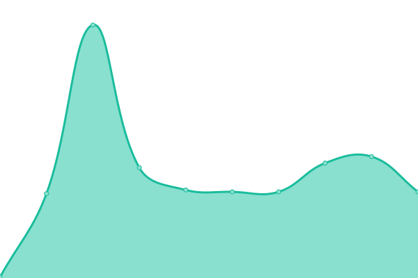
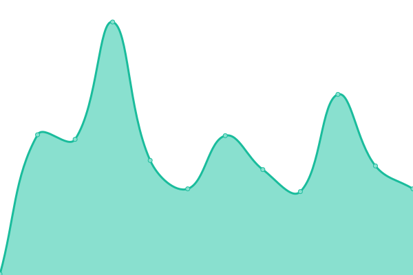

# [📈 Live Status](https://assia.github.io/upptime): <!--live status--> **🟩 All systems operational**

This repository contains the open-source uptime monitor and status page for [assia](https://assia.github.io/upptime), powered by [Upptime](https://github.com/upptime/upptime).

<!--start: status pages-->
<!-- This summary is generated by Upptime (https://github.com/upptime/upptime) -->
<!-- Do not edit this manually, your changes will be overwritten -->
<!-- prettier-ignore -->
| URL | Status | History | Response Time | Uptime |
| --- | ------ | ------- | ------------- | ------ |
|  [Site — Home](https://junioresiee.com/) | 🟩 Up | [site-home.yml](https://github.com/assia-mz/junior_web_next_upptime/commits/HEAD/history/site-home.yml) | 

 773ms
     
 | 

<a href="https://assia-mz.github.io/junior_web_next_upptime/history/site-home">98.75%</a>
    

|  [Site — Contact](https://junioresiee.com/contact) | 🟩 Up | [site-contact.yml](https://github.com/assia-mz/junior_web_next_upptime/commits/HEAD/history/site-contact.yml) | 

 157ms
     
 | 

<a href="https://assia-mz.github.io/junior_web_next_upptime/history/site-contact">98.75%</a>
    

|  [Site — About](https://junioresiee.com/about) | 🟩 Up | [site-about.yml](https://github.com/assia-mz/junior_web_next_upptime/commits/HEAD/history/site-about.yml) | 

 157ms
     
 | 

<a href="https://assia-mz.github.io/junior_web_next_upptime/history/site-about">98.75%</a>
    

|  [Site — Services](https://junioresiee.com/services) | 🟩 Up | [site-services.yml](https://github.com/assia-mz/junior_web_next_upptime/commits/HEAD/history/site-services.yml) | 

 166ms
     
 | 

<a href="https://assia-mz.github.io/junior_web_next_upptime/history/site-services">98.75%</a>
    

|  [Site — CGU](https://junioresiee.com/terms-of-service) | 🟩 Up | [site-cgu.yml](https://github.com/assia-mz/junior_web_next_upptime/commits/HEAD/history/site-cgu.yml) | 

 139ms
     
 | 

<a href="https://assia-mz.github.io/junior_web_next_upptime/history/site-cgu">98.75%</a>
    

<!--end: status pages-->

## 📄 License

- Powered by: [Upptime](https://github.com/upptime/upptime)
- Code: [MIT](./LICENSE) © [Anand Chowdhary](https://anandchowdhary.com), supported by [Pabio](https://pabio.com)
- Data in the `./history` directory: [Open Database License](https://opendatacommons.org/licenses/odbl/1-0/)
